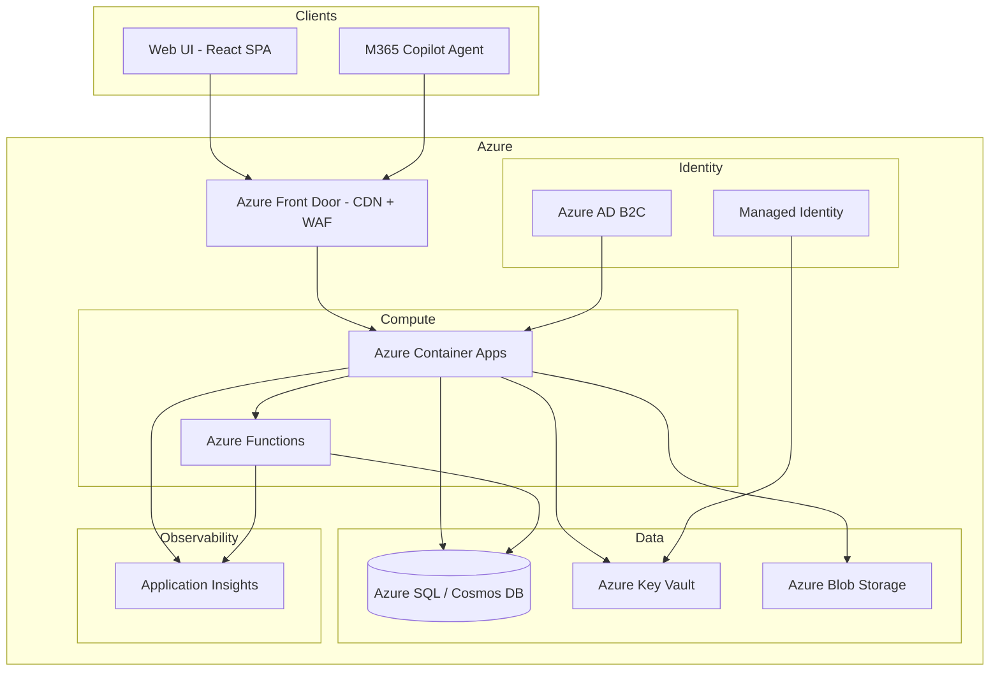

# Architecture

> This is a living document. Update it whenever system design changes.

## System Overview

## Key Decisions

| Decision | Choice | Rationale |
|----------|--------|-----------|
| Frontend framework | React 19 + Vite | Mature ecosystem, TypeScript-first, fast builds |
| Backend runtime | TBD (Node.js / Python / .NET) | Determined by Spec Planner based on project needs |
| Hosting | Azure Container Apps | Serverless containers, scale-to-zero, built-in ingress |
| Database | TBD (Azure SQL or Cosmos DB) | Depends on data model — relational vs document |
| Auth (customers) | Azure AD B2C | GDPR-compliant, customizable flows, MFA built-in |
| IaC | Bicep | Azure-native, simpler than Terraform for Azure-only |
| Deployment | azd via GitHub Actions | One-command deploy, environment management |
| M365 agent | Declarative agent | Marketplace-ready, runs on M365 Copilot orchestrator |

## API Design

- RESTful API with versioned paths: `/api/v1/...`
- Request/response validation with schema validation (zod for TS, pydantic for Python, etc.)
- Consistent error format: `{ error: { code, message, details? } }`
- Rate limiting on all public endpoints
- CORS restricted to known origins

## Data Flow

1. **Web UI**: React SPA → Azure Front Door (CDN + WAF) → Container Apps API
2. **M365 Agent**: Declarative agent → API Plugin → Container Apps API (same backend)
3. **Background tasks**: Azure Functions triggered by queues or schedules
4. **Auth**: Azure AD B2C issues JWT → validated by API middleware

## Security Architecture

- Azure Front Door WAF rules protect against OWASP Top 10 at the edge
- Azure AD B2C handles all customer authentication — no custom auth code
- Managed identities for all service-to-service communication
- Secrets stored in Key Vault, never in environment variables or code
- Application Insights for monitoring and anomaly detection
